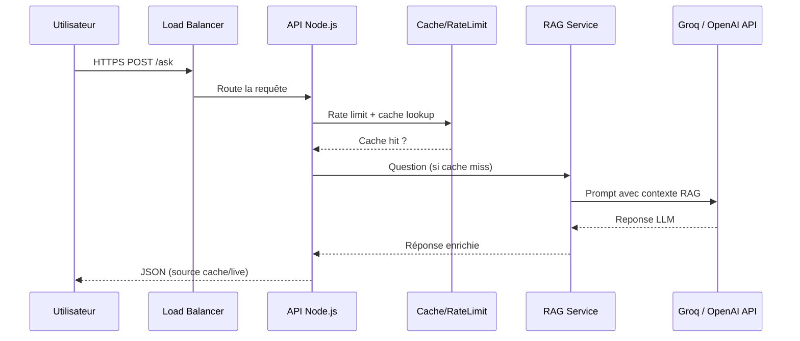

# LegalAI RAG Backend — Analyse Architecte

## Architecture & Structure
```
src/
  app.js                # Configuration Express, middlewares globaux
  server.js             # Point d'entree HTTP + shutdown gracieux
  controllers/
    askController.js    # Validation minimale + orchestration RAG/cache
  services/
    ragService.js       # Recherche contextuelle + appel Groq
    groqClient.js       # Client Groq initialise via dotenv
  middlewares/
    requestTimeout.js   # Timeout 10s hard-stop
    rateLimiter.js      # Limitation 60 req/min/IP
    cacheMiddleware.js  # Memoisation courte pour economiser l'API
    errorHandler.js     # Gestion globale des erreurs
  utils/
    cacheStore.js       # Cache en memoire TTL 5 min
    logger.js           # Logs JSON structuré
  data/
    data.js             # Base de connaissance (dont droit du travail)
```

## Justification RAG
- **Agilite legale** : Les lois evoluent vite; un simple update de `data.js` ou d'une base vectorielle evite un nouveau finetuning couteux.
- **Coût** : Finetuner GPT-4o ou Llama 3.1 sur données sensibles impliquerait >10k€ initiaux + hebergement GPU; RAG ne facture que l'inference.
- **RGPD** : Garder les documents en interne, controler la minimisation des donnees, et filtrer ce qui sort via le prompt systeme.

## Strategie Scale-out (trafic x3 ~ 270k req/j)
1. **Horizontal scaling** : Plusieurs pods Node (autoscaling HPA ou EC2 ASG) derrière le load balancer.
2. **External cache** : Passer du Map mémoire à Redis/KeyDB multi-région pour partager les hits.
3. **Observabilite** : Metrics Prometheus + autoscale sur CPU et latence P95 pour maintenir SLA 99.9%.

## Risques & Mitigation
- **Prompt injection** : Nettoyer les questions, restreindre les instructions via system prompt, surveiller les outputs et ajouter un garde-fou regex.
- **Fuite RGPD** : Chiffrement en transit (TLS), chiffrement au repos, RBAC sur la base documentaire, traçabilité des accès, politique de purge (<30 jours).

## Optimisation coûts
- **Modèles** : GPT-4o-mini pour 80% des requêtes; fallback GPT-4o sur cas complexes detectés par heuristique.
- **Cache** : LRU/TTL + regroupement des requêtes identiques; possibilité de Shared cache (Redis) + warm cache pour FAQ.
- **Batch / Async** : Regrouper les appels AI lorsque plusieurs agents internes demandent la même info.

## Mermaid (flux)

